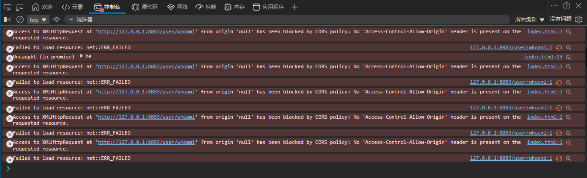
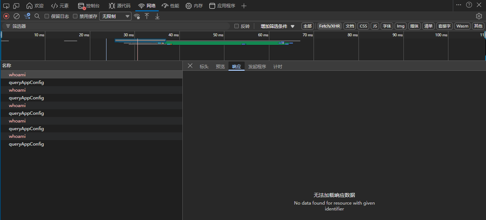
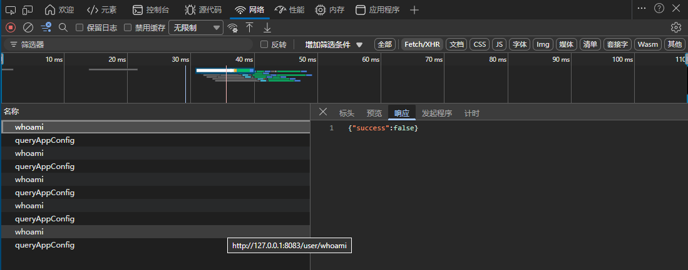

# MRE for [Can not capture the child class of "Exception" in app.exception_handler globally](https://github.com/fastapi/fastapi/discussions/7008)

## steps

1. `git clone https://github.com/4tst/mre-exception-handler.git`
2. `python server.py`
3. open `./frontend/index.html` in browser and watch `network tab in devtools`

### test 1
1. comment `@app.exception_handler(ValueError)`
2. refresh `index.html` and observe devtools

### test 2
1. uncomment `@app.exception_handler(ValueError)`
2. refresh `index.html` and observe devtools

### compare and problems

As you said at [https://github.com/fastapi/fastapi/discussions/7008#discussioncomment-14909380](https://github.com/fastapi/fastapi/discussions/7008#discussioncomment-14909380), if we don't add an exception handler for ValueError, then a ValueError thrown in the sub-route will be handled by the Exception handler, so the API returns 200 and the console prints the error stack.

There's no problem with the API's return code and the printed stack trace, and we can agree on that. 

However, the issue is that although the Exception handler is clearly set to return a normal JSON, why can't the client receive it? Moreover, we unexpectedly received a CORS error, even though the code has already allowed cross-origin requests.
